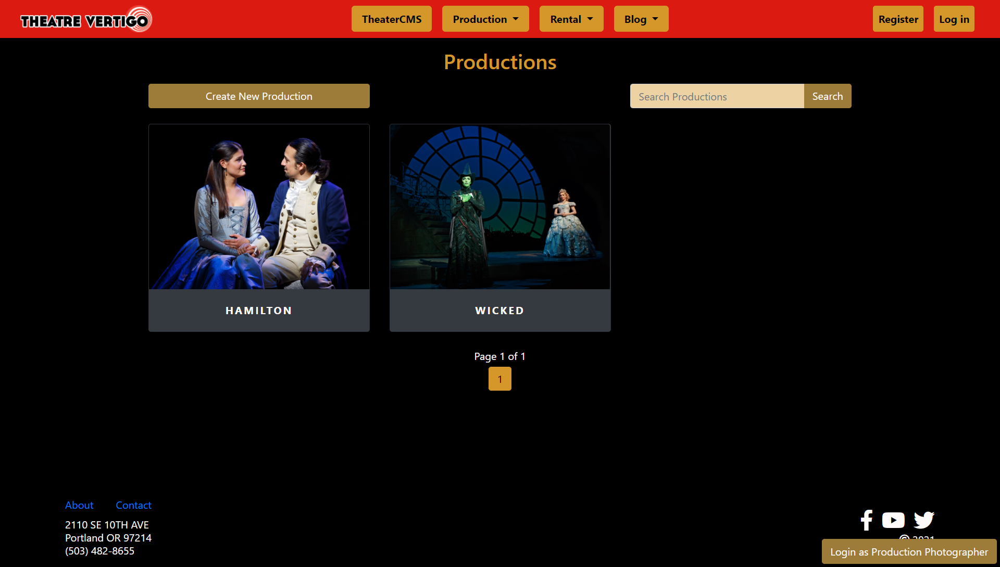
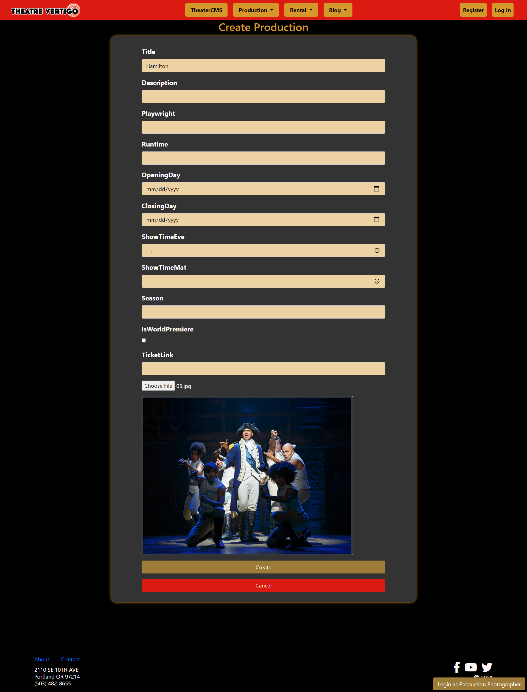
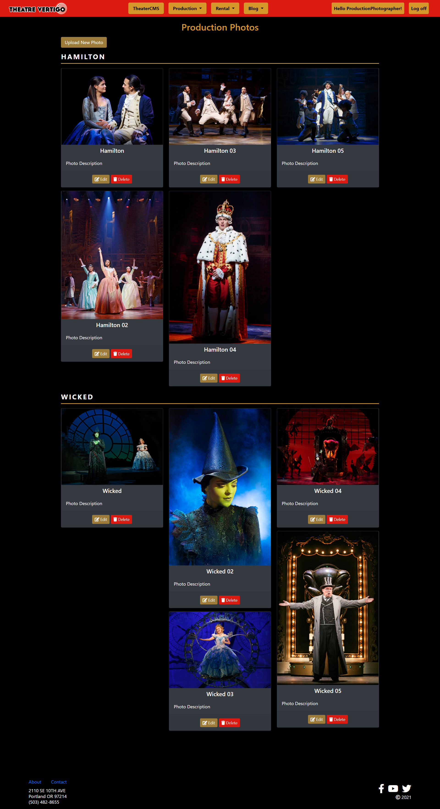

# ASP.NET MVC Theatre Website
This is a collection of code that I contributed for a new website being built for a theatre in Portland.  For this project I built out the Production and ProductionPhoto models.  Both of these models had full CRUD functionality as well as some other features.  I configured these models to have a One-To-Many relationship in the database, since each ProductionPhoto has an associated Production it's linked to.

I also created a special type of Identity User called a Production Photographer that is responsible for managing ProductionPhotos.

---
## Production Model

*Index page for Production Model with search and pagination*

*Creating productions along with a new default Production Photo*

---
## ProductionPhoto Model

*Index page for Production Photos*

---
## ProductionPhotographer User
This project is using Identity to manage its users. I was tasked with creating a special kind of user called a "Production Photographer." This type of user would be responsible for managing ProductionPhotos.

CRUD functionality for the ProductionPhoto model was restricted unless logged in as a ProductionPhotographer. To do this I created a custom `[Authorize]` attribute that redirects users to a Restricted Access page if they tried to access ProductionPhoto CRUD pages while not logged in as a ProductionPhotographer.

For testing and development I also implemented a quick login button to login as a Production Photographer that showed up in the bottom right corner of every page when the user was not logged into an account.  